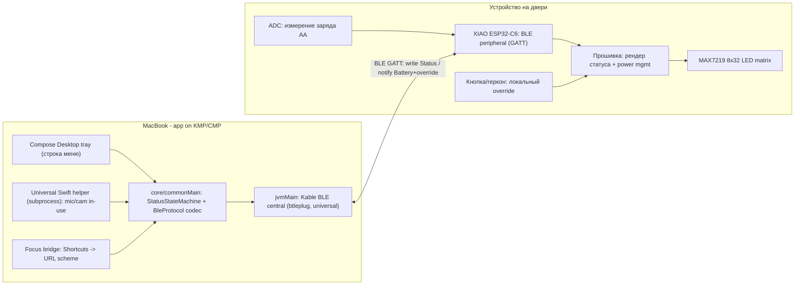
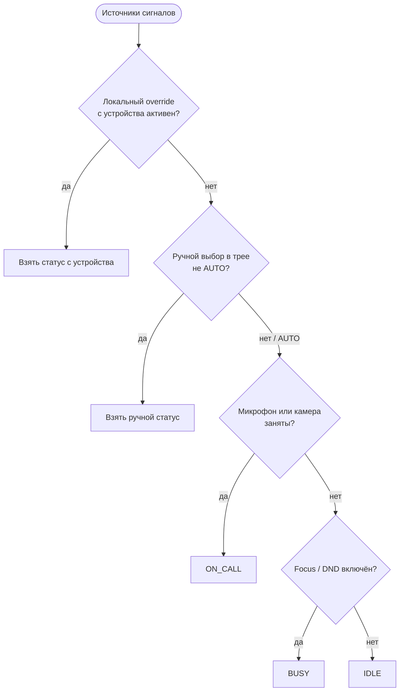
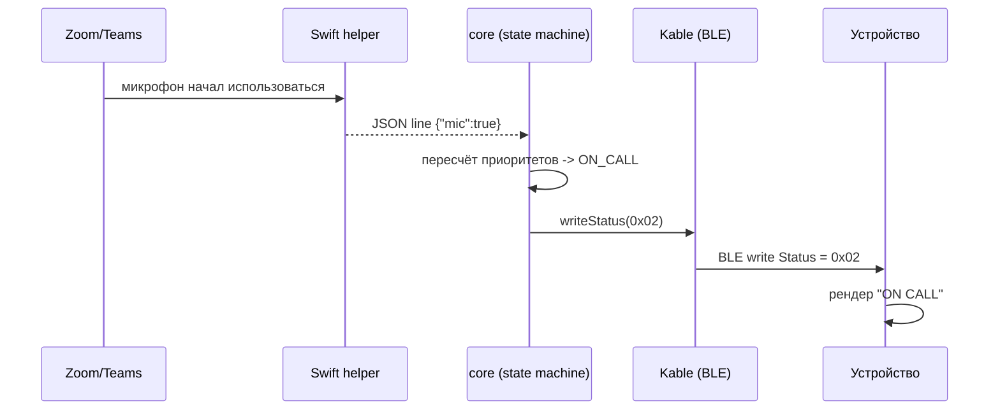

# Busy-Display — Master Plan & Architecture

> Беспроводная LED-табличка «НЕ БЕСПОКОИТЬ / BUSY» на батарейках, которая вешается на дверь
> и управляется с MacBook (ручное переключение + авто-детект звонка/Focus).
> Проект задуман как **open source**.

Это корневой документ. Он фиксирует архитектуру и **BLE-контракт — единый источник истины**.
Любое изменение контракта обязано синхронно правиться в трёх под-планах:

- [`01-hardware.md`](01-hardware.md) — что заказать и как собрать.
- [`02-firmware-device.md`](02-firmware-device.md) — прошивка устройства (XIAO ESP32-C6).
- [`03-macos-app.md`](03-macos-app.md) — софт для MacBook (KMP + Compose Multiplatform).

---

## 1. Цели и не-цели

### Цели (v1)
- Физическая табличка на двери показывает статус: `BUSY`, `ON CALL`, либо ничего (`IDLE`).
- Управление с MacBook **двумя способами одновременно**:
  - **Ручное** — клик в иконке строки меню.
  - **Авто** — занят микрофон/камера (= идёт звонок) и/или включён Focus/DND.
- Питание от **3xAA**; в `IDLE` потребление минимально (матрица гаснет).
- Связь **BLE** — без роутера, интернета и облака. Полностью локально.
- Поддержка **Intel и Apple Silicon** маков (Intel-first, т.к. у автора Intel).

### Не-цели (v1)
- Облако/мультипользовательность/мобильное приложение.
- Несколько табличек одновременно (но протокол это не запрещает).
- Цветной RGB-дисплей (берём монохром MAX7219 — энергоэффективно и читаемо).

---

## 2. Архитектура системы



### Ответственности компонентов
| Компонент | Отвечает за | Не отвечает за |
|---|---|---|
| `core` (commonMain) | доменная модель `Status`, машина приоритетов, кодек BLE-байтов | UI, OS-API, транспорт |
| `app` (jvmMain) | Compose-трей, Kable BLE central, запуск хелпера, Focus-мост | низкоуровневые macOS API |
| Swift helper (universal) | опрос микрофона/камеры (CoreAudio/CoreMediaIO) | UI, BLE |
| Прошивка | GATT-peripheral, рендер, power mgmt, локальный override, заряд | бизнес-логика приоритетов (она на Mac) |

**Принцип разделения:** вся логика «какой статус показать» живёт **на Mac** (в `core`).
Устройство — «тупой» исполнитель: получил байт статуса → нарисовал. Это упрощает прошивку,
делает поведение тестируемым на JVM и позволяет менять логику без перепрошивки.

---

## 3. BLE GATT-контракт (ЕДИНЫЙ ИСТОЧНИК ИСТИНЫ)

### Роли
- **Peripheral (server):** устройство (XIAO ESP32-C6). Делает advertising, хранит характеристики.
- **Central (client):** MacBook. Сканирует по Service UUID, подключается, пишет статус, читает заряд.

### Модель соединения
- Central держит **постоянное соединение** (для мгновенной реакции).
- На устройстве — высокая *slave latency* + умеренный *connection interval* для экономии (см. `02-firmware-device.md`).
- Безопасность v1: **без сопряжения (Just Works / no bonding)** — устройство персональное, рядом, риск низкий.
  Защита от чужой записи — опционально через простой shared-secret в `Text` (future).

### Идентификаторы
- **Device name (advertising):** `BusyLight`.
- **Service UUID (custom 128-bit):** `6e401b00-b5a3-f393-e0a9-e50e24dcca9e`
  *(базовый UUID проекта; ниже характеристики наследуют тот же базовый блок, меняется 16-битная часть)*

| Характеристика | UUID | Свойства | Формат |
|---|---|---|---|
| `Status` | `6e401b01-b5a3-f393-e0a9-e50e24dcca9e` | Read, Write, Notify | 1 байт enum (см. ниже) |
| `Text` | `6e401b02-b5a3-f393-e0a9-e50e24dcca9e` | Read, Write | UTF-8, до 32 байт (для `CUSTOM`) |
| `Battery Level` | `0x2A19` (стандартный, service `0x180F`) | Read, Notify | uint8, 0–100 (%) |

### Enum статусов (1 байт в `Status`)
| Значение | Имя | Что показывает устройство |
|---|---|---|
| `0x00` | `IDLE` | ничего (матрица в `shutdown`) |
| `0x01` | `BUSY` | статично «BUSY» (или «ЗАНЯТ») |
| `0x02` | `ON_CALL` | статично «ON CALL» / иконка телефона |
| `0x03` | `CUSTOM` | бегущая строка из характеристики `Text` |

### Обратный канал (устройство → Mac)
- `Status` **Notify**: если пользователь нажал локальную кнопку/снял геркон, устройство шлёт новый статус,
  чтобы Mac-приложение синхронизировало UI (локальный override).
- `Battery Level` **Notify**: периодически (например, раз в 5 мин или при изменении на ≥5%).

---

## 4. Машина состояний и приоритеты статуса

Итоговый статус вычисляется на Mac (`StatusStateMachine`) из нескольких источников.
**Приоритет (сверху вниз, первый сработавший выигрывает):**



Режимы в трее: `Авто` (по умолчанию), `Busy`, `On call`, `Custom…`, `Idle`.
Ручной выбор можно сделать «с таймером» (например, Busy на 25 мин → потом возврат в `Авто`).

---

## 5. Поток данных (звонок начался)



---

## 6. Кросс-платформенность (Intel + Apple Silicon)

Главное ограничение: **JetBrains убрали Apple x64-таргеты у Kotlin/Native и Compose Multiplatform (янв. 2026)**,
поэтому прежняя идея «нативный мост на `macosArm64`» **не соберётся на Intel**. Решение:

- **UI/ядро:** Compose Multiplatform **Desktop (JVM)** — работает на обоих чипах через JVM.
- **BLE:** **Kable (JVM-таргет)** на базе `btleplug` (Rust) — публикует нативные либы **под обе** mac-архитектуры (x86_64 + arm64). Кросс-арх «бесплатно». *(JVM-таргет Kable экспериментальный — см. риски.)*
- **Нативные macOS-сигналы** (микрофон/камера): не Kotlin/Native, а **маленький Swift-хелпер, собранный как universal binary** (`lipo` x86_64 + arm64), запускаемый как **subprocess** с JSON-протоколом по stdout. Просто, кросс-арх, тестируемо.
- **Focus/DND:** через **Shortcuts-автоматизацию** → URL-схема приложения.

Детали — в [`03-macos-app.md`](03-macos-app.md).

---

## 7. Структура репозитория (предложение)

```
busy-display/
  00-MASTER-architecture.md
  01-hardware.md
  02-firmware-device.md
  03-macos-app.md
  firmware/                 # PlatformIO проект (ESP32-C6)
  mac-app/                  # Gradle KMP проект
    core/                   # commonMain: домен + протокол
    app/                    # jvmMain: Compose tray + Kable
    helper/                 # Swift package -> universal binary
  hardware/                 # схемы, расчёты, фото, STL корпуса
  docs/                     # пользовательская документация
```

---

## 8. Этапы (milestones)

1. **M0 — Контракт зафиксирован** (этот документ). Блокирует обе софт-части.
2. **M1 — Hardware заказан и собран на breadboard** ([`01`](01-hardware.md)).
3. **M2 — Прошивка: матрица + GATT + рендер по статусу** ([`02`](02-firmware-device.md)).
4. **M3 — Mac: `core` + трей + Kable, ручное переключение end-to-end** ([`03`](03-macos-app.md)).
5. **M4 — Авто-детект: Swift-хелпер (mic/cam) + Shortcuts (Focus)**.
6. **M5 — Power tuning, сборка `.dmg`, автозапуск, корпус, полевые тесты**.

---

## 9. Риски и решения
| Риск | Влияние | Решение / fallback |
|---|---|---|
| Kable JVM экспериментален | BLE на Mac может глючить | Fallback: BLE-часть тоже вынести в Swift-хелпер (CoreBluetooth) и общаться по тому же JSON-IPC |
| ESP32-C6 BLE idle прожорливее nRF52 | короче ресурс AA | Матрица off в IDLE + высокая slave latency + light sleep; померить; опц. перейти на LiPo |
| Нет публичного API Focus | авто-Focus ненадёжен | Ставка на Shortcuts-автоматизацию (надёжно), а не парсинг приватных файлов |
| 3.3В логика ESP vs Vih MAX7219 | глюки дисплея | Питать матрицу от 4.5В (3xAA) → Vih падает; без level-shifter (см. `01`) |
| Нотаризация для open-source раздачи | пользователям сложно ставить | Инструкция по ad-hoc подписи + `xattr -dr com.apple.quarantine` |

---

## 10. Глоссарий
- **GATT** — Generic Attribute Profile, модель сервисов/характеристик в BLE.
- **Central / Peripheral** — клиент / сервер в BLE.
- **Slave latency** — сколько connection-событий peripheral может пропустить ради экономии.
- **Focus / DND** — режимы «Не беспокоить» в macOS.
- **KMP / CMP** — Kotlin Multiplatform / Compose Multiplatform.
- **Universal binary** — бинарь с кодом под x86_64 и arm64 (`lipo`).
