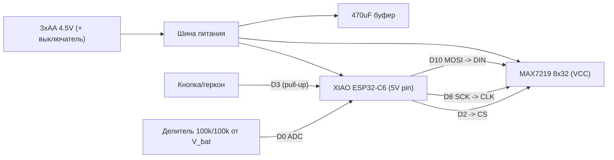

# 01 — Hardware (под-план)

Возврат к [мастер-плану](00-MASTER-architecture.md). Цель: список деталей под заказ, схема
подключения, питание/энергорасчёт и сборка таблички на базе **Seeed Studio XIAO ESP32-C6**.

---

## 1. Bill of Materials (что заказать)

### Основное
| # | Компонент | Кол-во | Примечание |
|---|---|---|---|
| 1 | **Seeed Studio XIAO ESP32-C6** | 1 | BLE 5 / Wi-Fi 6, USB-C для прошивки. Уже есть у вас. |
| 2 | **MAX7219 LED matrix, 4-in-1 (8x32), тип FC-16** | 1 | Хватает на «BUSY» статично и бегущую строку. |
| 3 | **Батарейный холдер 3xAA** | 1 | 4.5 В номинал. С выключателем — идеально. |
| 4 | **Ползунковый выключатель питания** | 1 | Если холдер без выключателя. |
| 5 | **Тактовая кнопка (момент.)** ИЛИ **геркон + магнит** | 1 | Локальный override. Геркон = буквальный «флаг». |

### Пассив / мелочёвка
| # | Компонент | Кол-во | Назначение |
|---|---|---|---|
| 6 | **Электролит 470 µF / 16 В** | 1 | Буфер на шине питания матрицы (импульсы мультиплексирования). |
| 7 | **Керамика 0.1 µF (100 nF), X7R, 50 В** | 5–6 | ВЧ-развязка: по 1 на каждый MAX7219 (4 шт) + у питания XIAO + у кнопки. |
| 8 | **Электролит 10 µF / 16 В** | 4 | Локальный резервуар у каждого MAX7219. |
| 9 | **Электролит 100 µF / 16 В** | 1 | Сглаживание у входа питания XIAO (всплески BLE-радио). |
| 10 | **Резистор 100 kΩ, 1%** | 2 | Делитель для измерения заряда батарей через ADC. |
| 11 | **Резистор 10 kΩ** | 1 | Подтяжка/защита (опц., если не использовать внутренний pull-up). |
| 12 | Dupont-провода, перфоплата/мини-breadboard | — | Прототип и финальная сборка. |
| 13 | Корпус (готовый/3D-печать) + крепление на дверь (Command-полоски/крючок) | — | Монтаж. |
| 14 | USB-C кабель | 1 | Прошивка/отладка. |

> Многие модули **FC-16 уже несут** на борту 0.1 µF и 10 µF возле каждого MAX7219.
> Если ваш модуль с ними — пп. 7 (частично) и 8 можно сократить, оставив буфер (п. 6) и питание XIAO (пп. 9).

### Спецификация конденсаторов (полностью)
- **Тип диэлектрика для 0.1 µF:** только **X7R или X5R** (НЕ Y5V — у него ёмкость рушится от напряжения/температуры).
- **Электролиты:** алюминиевые, low-ESR желательно; можно заменить на MLCC аналогичной ёмкости.
- **Напряжение:** правило «рейтинг ≥ 2× рабочей шины». Шина 4.5 В → минимум 10 В, берём **16 В** (запас + доступность).
- **Размещение:** 0.1 µF — **максимально близко** к выводам V+/GND чипа (это его задача — гасить ВЧ-шум). Буфер 470 µF — у точки ввода питания.

---

## 2. Почему 3xAA (а не 4xAA / boost до 5 В) — анализ уровней логики

GPIO ESP32-C6 — **3.3 В**. У MAX7219 порог логической единицы `Vih = 3.5 В` при `Vcc = 5 В`.
То есть 3.3 В сигнал DIN/CLK при 5 В питании матрицы — **на грани** (возможны глюки).

Решение без level-shifter: питать матрицу от **3xAA ≈ 4.5 В**. Тогда `Vih ≈ 0.7 × Vcc ≈ 3.15 В`,
и 3.3 В логика уверенно распознаётся. Это делает 3xAA оптимальным выбором по совместимости уровней.

**Рабочий диапазон:** свежие 3xAA ≈ 4.7–4.8 В; по мере разряда падает. Нижний практический предел —
**~3.6 В** (ниже проседает 3V3-LDO XIAO и заметно тускнеет матрица). Альтернатива для стабильной яркости —
buck/boost до фикс. 4.5–5 В, но это лишний ток покоя; для v1 не берём.

---

## 3. Схема подключения (XIAO ESP32-C6 → MAX7219)

MAX7219 управляется по SPI (3 линии) + питание. XIAO ESP32-C6 «D»-нумерация пинов:

| XIAO пин | GPIO | Подключение |
|---|---|---|
| D10 | GPIO18 (MOSI) | → **DIN** матрицы |
| D8 | GPIO19 (SCK) | → **CLK** матрицы |
| D2 | GPIO2 | → **CS / LOAD** матрицы |
| D3 | GPIO21 | → кнопка/геркон (вторая нога на GND), внутренний `INPUT_PULLUP` |
| D0 | GPIO0 (ADC1) | → средняя точка делителя 100k/100k от V_bat |
| 5V | — | ← «+» от 3xAA (через выключатель) |
| GND | — | ← общий «−» |

> Пины D-нумерации сверьте с **официальным pinout** Seeed для вашей ревизии (шелк на плате).
> CS можно повесить на любой свободный GPIO; здесь D2.

### Делитель для измерения заряда
`V_bat → 100k → (точка к D0/ADC) → 100k → GND`. Делит пополам: 4.5 В → 2.25 В (в пределах ADC ~0–3.1 В).
Параллельно нижнему резистору — небольшой 0.1 µF для сглаживания. Калибровка — в прошивке ([`02`](02-firmware-device.md)).

---

## 4. Энергобюджет и ресурс батарей (ориентировочно)

AA alkaline ≈ 2000 mAh. Главные потребители: матрица (когда горит) и ESP32-C6 BLE (всегда).

| Сценарий | Ток (оценка) | Что входит |
|---|---|---|
| `IDLE`, матрица в `shutdown`, BLE connected, light sleep | ~5–12 mA | в основном ESP32-C6 BLE |
| `BUSY`/`ON_CALL`, средняя яркость | +100–250 mA | матрица 8x32 (мультиплекс) |
| `BUSY` макс. яркость | до ~400 mA | редко нужно |

Грубая прикидка ресурса (2000 mAh):
- Никогда не горит (только IDLE ~8 mA): ~250 ч ≈ **10 дней**.
- Горит ~3 ч/день при ~150 mA + остальное IDLE: дневной расход ≈ 150·3 + 8·21 ≈ 618 mAh/день → **~3 дня**.

**Выводы по дизайну:**
- Обязательно гасить матрицу (`MAX7219 shutdown`) в `IDLE` — это ключевая экономия.
- Снижать яркость (`intensity`) до читаемого минимума.
- На устройстве настроить **высокую slave latency** BLE (см. [`02`](02-firmware-device.md)) — уводит ESP к единицам mA.
- Если ресурса мало — это аргумент за переход на **LiPo** (XIAO имеет `BAT`-падры и зарядку) в v2.

---

## 5. Сборка (этапы)
1. **Breadboard:** XIAO + матрица (только SPI + питание от USB 5 В). Прошить тест «бегущая строка» — проверить распиновку и модуль.
2. **Питание от 3xAA:** перейти на батарейное питание, проверить уровни логики и яркость на 4.5 В; добавить конденсаторы (470 µF буфер + 0.1 µF у чипов + 100 µF у XIAO).
3. **Кнопка/геркон + делитель ADC:** добавить локальный override и измерение заряда.
4. **Перфоплата:** перепаять с breadboard на перфоплату/протоплату, зафиксировать провода.
5. **Корпус:** разместить матрицу за окошком (можно тонировать акрил для контраста), вывести выключатель и кнопку; крепление на дверь.

---

## 6. Приёмочные критерии (hardware)
- [ ] Матрица читается с 2–3 м при выбранной яркости.
- [ ] 3.3 В логика управляет матрицей без артефактов при 4.5 В питании.
- [ ] В `IDLE` измеренный ток ≤ ~12 mA (мультиметром по разрыву питания).
- [ ] Кнопка/геркон стабильно переключает локальный override (без дребезга после фикса).
- [ ] ADC даёт монотонную оценку заряда от свежих до ~3.6 В.

## 7. Безопасность
- Соблюдать полярность батарей; рассмотреть диод Шоттки/защиту от переполюсовки на входе.
- Не запитывать матрицу на макс. яркости от слабых/старых батарей (просадка → перезагрузки ESP).
- Электролиты ставить с учётом полярности.
